# Vulkan Graphics Template

> **Audience:** Beginners to intermediate C++ developers who want to understand a real-world Vulkan rendering engine.
> Every concept is explained from first principles — no prior Vulkan or GPU knowledge is assumed.

---

## Table of Contents

1. [What Does This Project Do?](#1-what-does-this-project-do)
2. [The Big Picture — Architecture Overview](#2-the-big-picture--architecture-overview)
3. [Folder Structure](#3-folder-structure)
4. [The Technology Stack](#4-the-technology-stack)
5. [Object-Oriented Programming (OOP) Concepts Used](#5-object-oriented-programming-oop-concepts-used)
6. [The Core Engine — Class-by-Class Breakdown](#6-the-core-engine--class-by-class-breakdown)
    - 6.1 [Window](#61-window)
    - 6.2 [VulkanContext](#62-vulkancontext)
    - 6.3 [Swapchain](#63-swapchain)
    - 6.4 [Pipeline](#64-pipeline)
    - 6.5 [MeshBuffer](#65-meshbuffer)
    - 6.6 [CommandContext](#66-commandcontext)
    - 6.7 [Application](#67-application)
    - 6.8 [Layer](#68-layer)
7. [The App Layer — User-Facing Code](#7-the-app-layer--user-facing-code)
8. [The Shader System](#8-the-shader-system)
9. [The Build System (CMake)](#9-the-build-system-cmake)
10. [Vulkan Functions & Concepts — Complete Reference](#10-vulkan-functions--concepts--complete-reference)
11. [Frame Lifecycle — What Happens Every Frame](#11-frame-lifecycle--what-happens-every-frame)
12. [Memory Management Strategy](#12-memory-management-strategy)
13. [How the Architecture Evolved](#13-how-the-architecture-evolved)

---

## 1. What Does This Project Do?

This project is a **Vulkan-based graphics engine template**. It opens a window and draws colored rectangles on the screen using the GPU. More importantly, it provides a **clean, extensible foundation** for building your own graphics applications — games, visualizers, simulations, etc.

Think of it like this:


**You write the fun part** (what to draw, how to move things) in the `AppLayer`. The engine handles all the scary Vulkan boilerplate for you.

---

## 2. The Big Picture — Architecture Overview

This project uses a **Core/App split architecture** (inspired by game engines like those by The Cherno). The code is physically and logically divided into two parts:

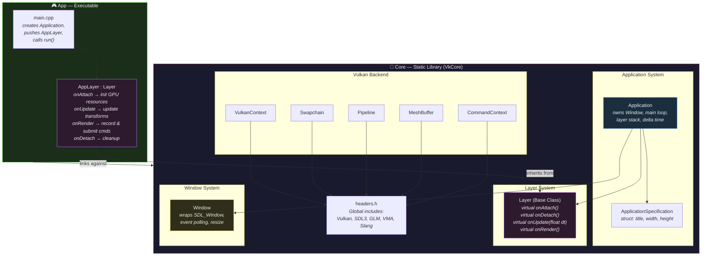

> [!IMPORTANT]
> **Key insight:** `Core` is a **static library** — it gets compiled separately and is *linked into* the app executable. This means you could theoretically build multiple different apps that all share the same core engine, just by writing different `AppLayer` classes.

### Why This Matters

| Without This Architecture | With This Architecture |
|---|---|
| Everything in one blob | Clean library boundary |
| Changing rendering logic means touching engine code | Change your `AppLayer` only |
| Hard to reuse in new projects | Link `VkCore`, write new `AppLayer` |
| No enforced separation | Compiler enforces the boundary |

---

## 3. Folder Structure

```
Vulkan-Graphics-Template/
│
├── 📄 CMakeLists.txt              ← Root build file — defines both targets
├── 📄 README.md                   ← Project overview
├── 📄 LICENSE                     ← License file
│
├── 📁 core/                       ← STATIC LIBRARY target: "VkCore"
│   ├── 📄 Core.h                  ← Single public include header
│   ├── 📄 headers.h               ← All external library includes
│   │
│   ├── 📄 Application.h / .cpp    ← Engine's main loop & layer management
│   ├── 📄 ApplicationSpecification.h ← Config structs (title, size)
│   ├── 📄 Layer.h                 ← Abstract base class for user layers
│   ├── 📄 Window.h / .cpp         ← SDL3 window wrapper
│   │
│   ├── 📄 VulkanContext.h / .cpp  ← Vulkan instance, device, queues
│   ├── 📄 Swapchain.h / .cpp      ← Swapchain & image views
│   ├── 📄 Pipeline.h / .cpp       ← Graphics pipeline & shader compilation
│   ├── 📄 MeshBuffer.h / .cpp     ← Vertex/index buffers via VMA
│   └── 📄 CommandContext.h / .cpp ← Command pools, buffers & sync objects
│
├── 📁 app/                        ← EXECUTABLE target: "app"
│   ├── 📄 main.cpp                ← Entry point — tiny bootstrapping
│   ├── 📄 AppLayer.h / .cpp       ← YOUR rendering logic lives here
│
└── 📁 shaders/
    └── 📄 Shaders.hlsl            ← HLSL shaders (compiled at runtime)
```

---

## 4. The Technology Stack

Here's every external library and what role it plays:

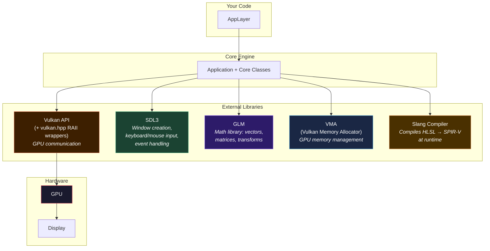

### Library Breakdown

| Library | What It Does | Why We Need It |
|---|---|---|
| **Vulkan** (`vulkan.hpp`, `vulkan_raii.hpp`) | Low-level GPU API for rendering | Talks to the GPU — draws pixels |
| **SDL3** | Cross-platform window/event system | Creates the window, handles keyboard/mouse |
| **GLM** | OpenGL Mathematics library | Provides `vec2`, `vec3`, `mat4`, transforms |
| **VMA** (Vulkan Memory Allocator) | Allocates GPU memory intelligently | Makes buffer creation much simpler |
| **Slang** | Shader compiler | Compiles HLSL shader code to SPIR-V at runtime |

> [!NOTE]
> **Why `vulkan_raii.hpp`?** Vulkan has a C API where you must manually destroy every resource you create. The C++ RAII wrappers (`vk::raii::*`) automatically destroy resources when they go out of scope — just like `std::unique_ptr` does for regular pointers. This is one of the project's most important design decisions.

---

## 5. Object-Oriented Programming (OOP) Concepts Used

This project is a showcase of practical OOP in C++. Let's walk through every major OOP concept used, with concrete examples from the codebase.

### 5.1 Classes and Objects

A **class** is a blueprint for creating objects. An **object** is an instance of a class — a concrete thing in memory.

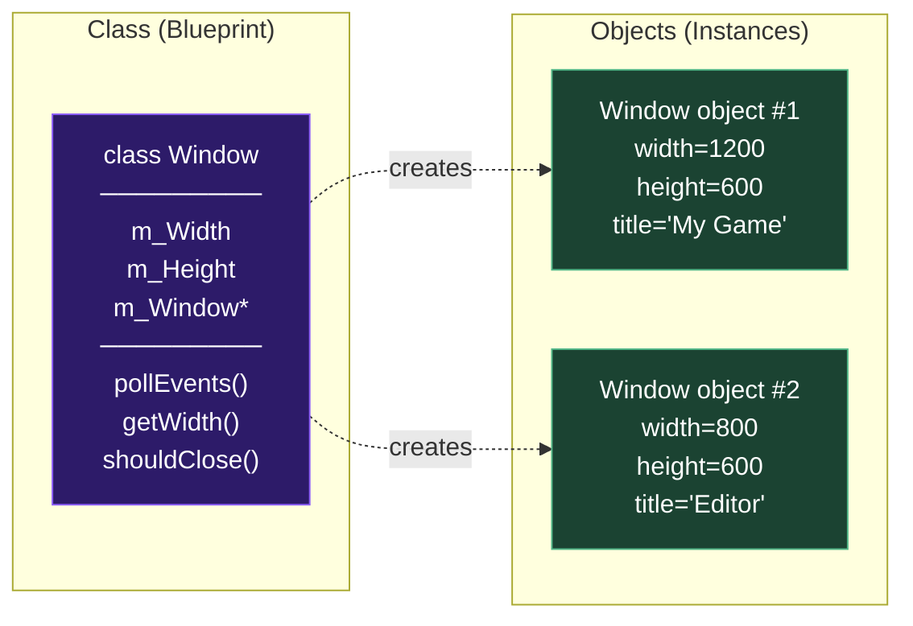

In this project, there are several classes:
- `Window`, `VulkanContext`, `Swapchain`, `Pipeline`, `MeshBuffer`, `CommandContext`, `Application`, `Layer`, `AppLayer`

Each is created (instantiated) at some point during the application's lifecycle.

### 5.2 Encapsulation

**Encapsulation** means bundling data and the functions that operate on that data together, and controlling access to them via `public` / `private`.

**Example — [Window](file:///c:/Users/ojasm/source/repos/Vulkan-Graphics-Template/core/Window.h) class:**

```cpp
class Window {
public:   // ← Things ANYONE can use
    Window(const std::string& title, uint32_t width, uint32_t height);
    ~Window();
    void     pollEvents();
    uint32_t getWidth()  const;
    uint32_t getHeight() const;
    bool     shouldClose() const;

private:  // ← Things ONLY the Window class itself can touch
    SDL_InitRAII m_SDLInit{ SDL_INIT_VIDEO };
    SDL_Window*  m_Window            = nullptr;
    uint32_t     m_Width;
    uint32_t     m_Height;
    bool         m_ShouldClose       = false;
    bool         m_FramebufferResized = false;
};
```

> **Why?** Outside code calls `window.getWidth()` instead of directly accessing `m_Width`. This means the `Window` class can change how width is stored internally without breaking any code that uses it.

### 5.3 Inheritance

**Inheritance** lets you create a new class based on an existing class, inheriting its functionality and adding/overriding behavior.

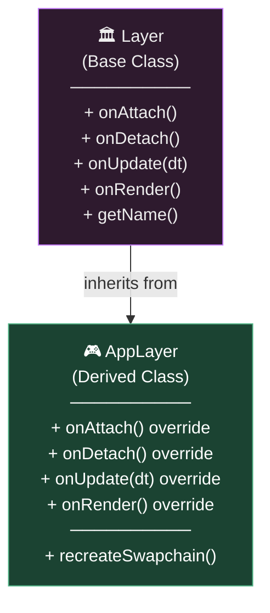

**In the code ([AppLayer.h](file:///c:/Users/ojasm/source/repos/Vulkan-Graphics-Template/app/AppLayer.h#L11)):**
```cpp
class AppLayer : public Layer {  // ← "AppLayer IS-A Layer"
    void onAttach()  override;   // ← Replaces the base class's empty function
    void onDetach()  override;
    void onUpdate(float deltaTime) override;
    void onRender()  override;
};
```

The `override` keyword tells the compiler: "I intend to override a virtual function from the base class. If there's no matching virtual function, give me an error." This is a safety net.

### 5.4 Polymorphism

**Polymorphism** means "many forms." The same function call can do different things depending on the actual type of object.

**In practice — [Application::run()](file:///c:/Users/ojasm/source/repos/Vulkan-Graphics-Template/core/Application.cpp#L62-L84):**
```cpp
// Application holds a vector of Layer POINTERS
std::vector<Layer*> m_LayerStack;

// When it calls onRender(), it doesn't know the concrete type.
// It just calls the virtual function — C++ dispatches to the correct override.
for (Layer* layer : m_LayerStack) {
    layer->onRender();  // ← calls AppLayer::onRender() if the pointer is to an AppLayer
}
```

This is the **magic** of polymorphism: `Application` never needs to know about `AppLayer`. It only knows about the `Layer` interface. You could create `UILayer`, `DebugLayer`, `PhysicsLayer` — the `Application` would iterate over all of them the same way.

### 5.5 Abstraction

**Abstraction** means hiding complex implementation details behind a simple interface.

The `Layer` base class is a perfect example:
```cpp
class Layer {
public:
    virtual void onAttach()  {}
    virtual void onDetach()  {}
    virtual void onUpdate(float deltaTime) {}
    virtual void onRender() {}
};
```

This is as simple as it gets. A user creating a new layer doesn't need to understand Vulkan *at all* — they just override the functions they care about.

### 5.6 Composition ("Has-A" Relationship)

**Composition** means a class contains instances of other classes as members.

**[Application](file:///c:/Users/ojasm/source/repos/Vulkan-Graphics-Template/core/Application.h#L26-L30) composes several subsystems:**
```cpp
class Application {
private:
    std::unique_ptr<Window>         m_Window;          // Application HAS-A Window
    std::unique_ptr<VulkanContext>  m_Ctx;             // Application HAS-A VulkanContext
    std::unique_ptr<Swapchain>      m_Swapchain;       // Application HAS-A Swapchain
    std::unique_ptr<CommandContext> m_CommandContext;   // Application HAS-A CommandContext
    std::vector<Layer*>             m_LayerStack;       // Application HAS many Layers
};
```

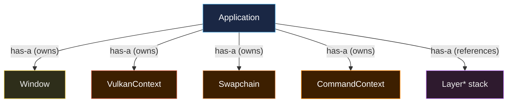

### 5.7 RAII (Resource Acquisition Is Initialization)

**RAII** is a critical C++ pattern: **you acquire a resource in a constructor, and release it in the destructor**. This guarantees cleanup even if an exception is thrown.

This project uses RAII everywhere:

| Class | Acquires in Constructor | Releases in Destructor |
|---|---|---|
| `SDL_InitRAII` | Calls `SDL_Init()` | Calls `SDL_Quit()` |
| `Window` | Creates `SDL_Window*` | Calls `SDL_DestroyWindow()` |
| `VMAWrapper` | Holds `VmaAllocator` | Calls `vmaDestroyAllocator()` |
| `VMABuffer` | Holds `VkBuffer` + `VmaAllocation` | Calls `vmaDestroyBuffer()` |
| All `vk::raii::*` types | Create Vulkan objects | Destroy them automatically |

**Example — [VMABuffer](file:///c:/Users/ojasm/source/repos/Vulkan-Graphics-Template/core/MeshBuffer.h#L4-L19):**
```cpp
struct VMABuffer {
    VkBuffer      buffer     = nullptr;
    VmaAllocation allocation = nullptr;
    VmaAllocator  allocator  = nullptr;

    ~VMABuffer() {
        if (buffer && allocation && allocator) {
            vmaDestroyBuffer(allocator, buffer, allocation);  // ← automatic cleanup!
        }
    }

    // Delete copy constructor/assignment to prevent double-free
    VMABuffer(const VMABuffer&) = delete;
    VMABuffer& operator=(const VMABuffer&) = delete;
};
```

> [!TIP]
> Notice the **deleted copy constructor**. If you could copy a `VMABuffer`, both copies would try to destroy the same GPU buffer when they go out of scope — a classic **double-free bug**. By deleting the copy operations, the compiler prevents this mistake entirely.

### 5.8 Smart Pointers (`std::unique_ptr`)

**Smart pointers** are RAII wrappers for heap-allocated memory. `std::unique_ptr<T>` owns the object exclusively and deletes it when the `unique_ptr` goes out of scope.

**Used extensively in [Application](file:///c:/Users/ojasm/source/repos/Vulkan-Graphics-Template/core/Application.h#L27-L30):**
```cpp
std::unique_ptr<Window>         m_Window;
std::unique_ptr<VulkanContext>  m_Ctx;
std::unique_ptr<Swapchain>      m_Swapchain;
std::unique_ptr<CommandContext> m_CommandContext;
```

**And in [AppLayer](file:///c:/Users/ojasm/source/repos/Vulkan-Graphics-Template/app/AppLayer.h#L23-L34):**
```cpp
std::unique_ptr<Pipeline>   m_Pipeline;
std::unique_ptr<MeshBuffer> player1;
std::unique_ptr<MeshBuffer> player2;
```

> **Why `unique_ptr` instead of raw pointers?** You never have to remember to `delete` them. When the `Application` is destroyed, all its `unique_ptr` members are automatically destroyed in reverse order — which is crucial because Vulkan resources must be cleaned up in a specific order.

---

## 6. The Core Engine — Class-by-Class Breakdown

Let's walk through every class in the `core/` directory, explaining what it does, why it exists, and what Vulkan/library functions it calls.

---

### 6.1 Window

📄 **Files:** [Window.h](file:///c:/Users/ojasm/source/repos/Vulkan-Graphics-Template/core/Window.h) / [Window.cpp](file:///c:/Users/ojasm/source/repos/Vulkan-Graphics-Template/core/Window.cpp)

**Purpose:** Wraps SDL3 window creation and event handling. This is the OS-level window that appears on your screen.

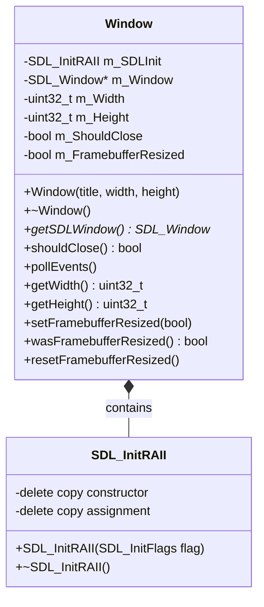

#### How `SDL_InitRAII` Works

Before you can create any SDL window, you must initialize the SDL library. `SDL_InitRAII` wraps this in RAII:

```cpp
struct SDL_InitRAII {
    SDL_InitRAII(SDL_InitFlags flag) {
        if (!SDL_Init(flag)) {  // ← Initializes SDL (VIDEO subsystem)
            throw std::runtime_error("Failed to initiate SDL3");
        }
    }
    ~SDL_InitRAII() {
        SDL_Quit();  // ← Guaranteed cleanup, even on exception
    }
};
```

Since `m_SDLInit` is a member of `Window`, SDL is initialized *before* the window constructor body runs (because member initialization order follows declaration order), and cleaned up *after* `m_Window` is destroyed in the destructor.

#### Window Constructor

```cpp
Window::Window(const std::string& title, uint32_t width, uint32_t height)
    : m_Width(width), m_Height(height)
{
    m_Window = SDL_CreateWindow(
        title.c_str(), m_Width, m_Height,
        SDL_WINDOW_VULKAN        |   // ← Window supports Vulkan rendering
        SDL_WINDOW_HIGH_PIXEL_DENSITY |  // ← HiDPI/Retina support
        SDL_WINDOW_RESIZABLE     |   // ← User can resize the window
        SDL_WINDOW_TRANSPARENT       // ← Supports transparent backgrounds
    );
}
```

| SDL Function | What It Does |
|---|---|
| `SDL_Init(SDL_INIT_VIDEO)` | Initializes the SDL video subsystem |
| `SDL_CreateWindow(...)` | Creates an OS window with the given flags |
| `SDL_DestroyWindow(...)` | Frees the window resources |
| `SDL_PollEvent(...)` | Checks for user input events (close, resize, keys) |
| `SDL_GetWindowSizeInPixels(...)` | Gets the actual pixel dimensions (important for HiDPI) |
| `SDL_Quit()` | Shuts down SDL |

#### Event Polling

```cpp
void Window::pollEvents() {
    SDL_Event event;
    while (SDL_PollEvent(&event)) {
        switch (event.type) {
            case SDL_EVENT_QUIT:
                m_ShouldClose = true;       // ← User clicked the X button
                break;
            case SDL_EVENT_WINDOW_PIXEL_SIZE_CHANGED:
                // Update width/height and flag that the framebuffer needs recreation
                SDL_GetWindowSizeInPixels(m_Window, (int*)&m_Width, (int*)&m_Height);
                m_FramebufferResized = true;
                break;
        }
    }
}
```

---

### 6.2 VulkanContext

📄 **Files:** [VulkanContext.h](file:///c:/Users/ojasm/source/repos/Vulkan-Graphics-Template/core/VulkanContext.h) / [VulkanContext.cpp](file:///c:/Users/ojasm/source/repos/Vulkan-Graphics-Template/core/VulkanContext.cpp)

**Purpose:** This is the **foundation of all Vulkan operations**. It initializes the Vulkan runtime, picks a GPU, creates a logical device, sets up memory allocation, and creates a descriptor pool.

Think of it as the "handshake" between your application and the GPU.

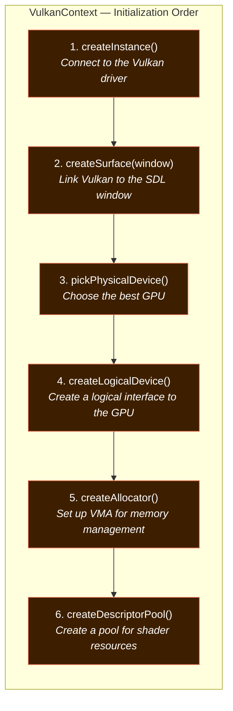

#### What Each Member Is

```cpp
class VulkanContext {
public:
    vk::raii::Context        context;         // Entry point for Vulkan function loading
    vk::raii::Instance       instance;        // The Vulkan instance (represents your app)
    vk::raii::SurfaceKHR     surface;         // The rendering surface tied to the window
    vk::raii::PhysicalDevice physicalDevice;  // The actual GPU hardware
    vk::raii::Device         device;          // The logical device (your interface to the GPU)
    vk::raii::Queue          graphicsQueue;   // Queue for submitting rendering commands
    vk::raii::Queue          presentQueue;    // Queue for presenting images to the screen
    QueueFamilyIndices       indices;         // Which queue families support graphics/presentation
    VMAWrapper               allocator;       // VMA memory allocator
    vk::raii::DescriptorPool descriptorPool;  // Pool for allocating descriptor sets
};
```

#### Step 1: Creating the Vulkan Instance

```cpp
void VulkanContext::createInstance() {
    vk::ApplicationInfo appInfo(
        "Vulkan Subject",           // Application name
        VK_MAKE_VERSION(1, 0, 0),   // Application version
        "Basic Engine",             // Engine name
        VK_MAKE_VERSION(1, 0, 0),   // Engine version
        VK_API_VERSION_1_4          // ← Targets Vulkan 1.4!
    );
```

> [!NOTE]
> **What is a Vulkan Instance?** Think of it as telling the Vulkan driver: "Hello, I'm an application called 'Vulkan Subject', and I'd like to use Vulkan 1.4 features." It's the first thing you create and the last thing destroyed.

**Validation Layers:**
```cpp
#ifdef NDEBUG
    std::vector<const char*> validationLayers = {};        // Release: no validation
#else
    std::vector<const char*> validationLayers = {
        "VK_LAYER_KHRONOS_validation"                       // Debug: full validation!
    };
#endif
```

Validation layers are like having a strict teacher check your Vulkan homework. In debug builds, they catch every mistake (wrong parameters, missing synchronization, etc.). In release builds, they're removed for performance.

#### Step 2: Creating the Surface

```cpp
void VulkanContext::createSurface(SDL_Window* window) {
    VkSurfaceKHR c_surface;
    SDL_Vulkan_CreateSurface(window, *instance, nullptr, &c_surface);
    surface = vk::raii::SurfaceKHR(instance, c_surface);
}
```

A **surface** is the bridge between Vulkan and the OS window. Without it, Vulkan wouldn't know *where* to display the rendered image.

#### Step 3: Picking a Physical Device (GPU)

```cpp
void VulkanContext::pickPhysicalDevice() {
    vk::raii::PhysicalDevices devices(instance);  // Get ALL GPUs on the system

    // First, try to find a discrete (dedicated) GPU
    for (const auto& d : devices) {
        if (d.getProperties().deviceType == vk::PhysicalDeviceType::eDiscreteGpu
            && isDeviceSuitable(d)) {
            physicalDevice = d;
            break;
        }
    }
    // Fallback: any GPU that supports what we need
    if (!*physicalDevice) { /* try integrated GPUs... */ }
}
```

The code prefers a **discrete GPU** (a dedicated graphics card like NVIDIA/AMD) over an **integrated GPU** (built into the CPU) because discrete GPUs are much more powerful for rendering.

The `isDeviceSuitable()` lambda checks that the GPU supports the **swapchain extension** (`VK_KHR_SWAPCHAIN_EXTENSION_NAME`), which is required to present images to the screen.

#### Step 4: Creating the Logical Device

A **physical device** represents the hardware. A **logical device** is your application's interface to it — you can request specific features and queues.

```cpp
void VulkanContext::createLogicalDevice() {
    // Find queue families that support graphics and presentation
    for (const auto& queueFamily : queueFamilies) {
        if (queueFamily.queueFlags & vk::QueueFlagBits::eGraphics) {
            indices.graphicsFamily = i;  // "This queue family can do graphics"
        }
        if (physicalDevice.getSurfaceSupportKHR(i, *surface)) {
            indices.presentFamily = i;   // "This queue family can present to the screen"
        }
    }
```

**Enabled Features:**

| Feature | Why It's Needed |
|---|---|
| `dynamicRendering` (Vulkan 1.3) | Allows rendering without legacy render pass objects |
| `maintenance5` (Vulkan 1.4) | Provides latest maintenance fixes and features |
| `shaderDrawParameters` (Vulkan 1.1) | Access to `gl_DrawID` and similar built-ins in shaders |
| `fillModeNonSolid` | Allows wireframe rendering mode |

#### Step 5: Creating the VMA Allocator

```cpp
void VulkanContext::createAllocator() {
    VmaAllocatorCreateInfo allocatorInfo = {};
    allocatorInfo.vulkanApiVersion = VK_API_VERSION_1_4;
    allocatorInfo.physicalDevice   = *physicalDevice;
    allocatorInfo.device           = *device;
    allocatorInfo.instance         = *instance;
    vmaCreateAllocator(&allocatorInfo, &allocator.handle);
}
```

> [!TIP]
> **Why VMA instead of raw Vulkan memory?** In raw Vulkan, allocating GPU memory is extremely complex — you need to query memory types, handle alignment, manage suballocations, and avoid exceeding the GPU's allocation limit. VMA handles ALL of this for you in a single `vmaCreateBuffer()` call.

#### Step 6: Creating the Descriptor Pool

```cpp
void VulkanContext::createDescriptorPool() {
    std::array<vk::DescriptorPoolSize, 1> poolSizes = {
        vk::DescriptorPoolSize(vk::DescriptorType::eUniformBuffer, 10)
    };
    vk::DescriptorPoolCreateInfo poolInfo(
        vk::DescriptorPoolCreateFlagBits::eFreeDescriptorSet, 10, poolSizes
    );
    descriptorPool = vk::raii::DescriptorPool(device, poolInfo);
}
```

A **descriptor pool** is like a "budget" for shader resources. You pre-declare "I'll need up to 10 uniform buffers" and then allocate from this pool when you need them.

---

### 6.3 Swapchain

📄 **Files:** [Swapchain.h](file:///c:/Users/ojasm/source/repos/Vulkan-Graphics-Template/core/Swapchain.h) / [Swapchain.cpp](file:///c:/Users/ojasm/source/repos/Vulkan-Graphics-Template/core/Swapchain.cpp)

**Purpose:** Manages the **swapchain** — a queue of images that are displayed on screen. While the GPU renders to one image, another is being displayed.

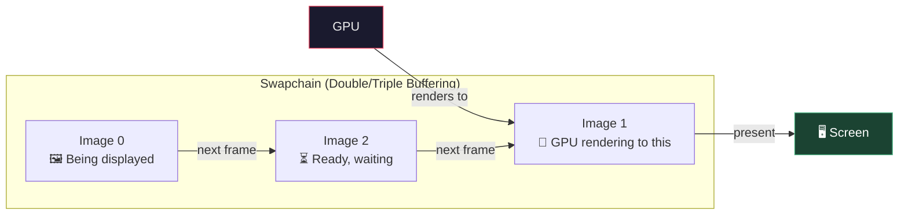

#### What It Stores

```cpp
class Swapchain {
public:
    vk::raii::SwapchainKHR           swapchain;   // The swapchain object itself
    vk::Format                       imageFormat;  // Pixel format (e.g., B8G8R8A8_SRGB)
    vk::Extent2D                     extent;       // Width x Height in pixels
    std::vector<vk::Image>           images;       // The actual image handles
    std::vector<vk::raii::ImageView> imageViews;   // "Lenses" to view the images
};
```

#### Surface Format Selection

```cpp
// Try to find the ideal format: B8G8R8A8 with sRGB non-linear color space
for (const auto& availableFormat : formats) {
    if (availableFormat.format == vk::Format::eB8G8R8A8Srgb &&
        availableFormat.colorSpace == vk::ColorSpaceKHR::eSrgbNonlinear) {
        surfaceFormat = availableFormat;
        break;
    }
}
```

| Format | Meaning |
|---|---|
| `eB8G8R8A8Srgb` | 8 bits per channel (Blue, Green, Red, Alpha), sRGB gamma |
| `eSrgbNonlinear` | Standard color space for monitors — colors look correct |

#### Present Mode

```cpp
vk::PresentModeKHR presentMode = vk::PresentModeKHR::eFifo;
```

| Present Mode | Meaning |
|---|---|
| `eFifo` | VSync ON — frames are presented at the monitor's refresh rate. No tearing. |
| `eMailbox` | Triple buffering — low latency, no tearing, but uses more power |
| `eImmediate` | No VSync — lowest latency but may tear |

#### Image Sharing Mode

```cpp
if (ctx.indices.graphicsFamily != ctx.indices.presentFamily) {
    createInfo.imageSharingMode = vk::SharingMode::eConcurrent;  // Two different queues
} else {
    createInfo.imageSharingMode = vk::SharingMode::eExclusive;   // Same queue — faster
}
```

If the graphics and presentation queues are from different queue families, the images must be shared between them. Otherwise, exclusive mode is faster.

#### Image Views

```cpp
void Swapchain::createImageViews(VulkanContext& ctx) {
    for (vk::Image image : images) {
        vk::ImageViewCreateInfo createInfo(
            {}, image, vk::ImageViewType::e2D, imageFormat,
            {}, { vk::ImageAspectFlagBits::eColor, 0, 1, 0, 1 }
        );
        imageViews.emplace_back(ctx.device, createInfo);
    }
}
```

An **Image View** is how you "look at" a Vulkan image. The same raw image could be viewed as a 2D texture, a cube face, a depth buffer, etc. Here, we view it as a 2D color image.

---

### 6.4 Pipeline

📄 **Files:** [Pipeline.h](file:///c:/Users/ojasm/source/repos/Vulkan-Graphics-Template/core/Pipeline.h) / [Pipeline.cpp](file:///c:/Users/ojasm/source/repos/Vulkan-Graphics-Template/core/Pipeline.cpp)

**Purpose:** Creates the **graphics pipeline** — this tells the GPU exactly *how* to process vertices and produce pixels. Also handles shader compilation via Slang.


#### Pipeline Configuration — Every Stage Explained

**1. Shader Stage Creation:**
```cpp
// Read HLSL source, compile to SPIR-V at runtime
std::string           shaderCode = readShaderFile("shaders/Shaders.hlsl");
std::vector<uint32_t> vertSpirv  = compileShadersToSPIRV(shaderCode, "vertexMain");
std::vector<uint32_t> fragSpirv  = compileShadersToSPIRV(shaderCode, "fragmentMain");

// Create shader modules from the SPIR-V binary
vk::raii::ShaderModule vertModule(ctx.device, vk::ShaderModuleCreateInfo({}, vertSpirv));
vk::raii::ShaderModule fragModule(ctx.device, vk::ShaderModuleCreateInfo({}, fragSpirv));
```

**2. Vertex Input State** — tells the pipeline how to read `Vertex` structs:
```cpp
// Binding: "Read one Vertex struct per vertex"
// Attributes: position (vec2) at offset 0, color (vec3) at offset 8
auto bindingDescription    = Vertex::getBindingDescription();
auto attributeDescriptions = Vertex::getAttributeDescriptions();
```

**3. Input Assembly** — how to group vertices:
```cpp
vk::PipelineInputAssemblyStateCreateInfo inputAssembly(
    {}, vk::PrimitiveTopology::eTriangleList, VK_FALSE
);
// eTriangleList: every 3 indices form one triangle
```

**4. Rasterization State:**
```cpp
vk::PipelineRasterizationStateCreateInfo rasterizer(
    {}, VK_FALSE, VK_FALSE,
    vk::PolygonMode::eFill,          // Fill triangles (vs. wireframe)
    vk::CullModeFlagBits::eNone,     // Don't cull any faces
    vk::FrontFace::eClockwise,       // Clockwise winding = front
    VK_FALSE, 0.0f, 0.0f, 0.0f, 1.0f
);
```

**5. Dynamic States:**
```cpp
std::vector<vk::DynamicState> dynamicStates = {
    vk::DynamicState::eViewport,
    vk::DynamicState::eScissor
};
```
These are set at draw time, not baked into the pipeline. This means you can resize the window without recreating the entire pipeline.

**6. Pipeline Layout** — declares what data the shaders expect:
```cpp
// Descriptor set layout: "Shader binding 0 = a uniform buffer for the vertex shader"
vk::DescriptorSetLayoutBinding uboLayoutBinding(
    0, vk::DescriptorType::eUniformBuffer, 1,
    vk::ShaderStageFlagBits::eVertex, nullptr
);

// Push constant range: "64 bytes of push constants for the vertex shader"
vk::PushConstantRange pushRange(
    vk::ShaderStageFlagBits::eVertex, 0, sizeof(pushConstantData)
);
```

**7. Dynamic Rendering** (Vulkan 1.3+):
```cpp
vk::PipelineRenderingCreateInfo pipelineRenderingInfo(
    0, 1, &swapchainImageFormat  // "This pipeline outputs to one color attachment"
);
pipelineInfo.pNext = &pipelineRenderingInfo;
```

> [!IMPORTANT]
> **Dynamic Rendering** (`VK_KHR_dynamic_rendering`) is a major simplification over traditional Vulkan. Normally, you'd need to create `VkRenderPass` and `VkFramebuffer` objects, which are verbose and inflexible. Dynamic rendering lets you specify attachments at draw time with `beginRendering()` / `endRendering()`.

#### Shader Compilation with Slang

The `compileShadersToSPIRV()` function uses the **Slang** compiler to transform HLSL source code into SPIR-V bytecode at runtime:


---

### 6.5 MeshBuffer

📄 **Files:** [MeshBuffer.h](file:///c:/Users/ojasm/source/repos/Vulkan-Graphics-Template/core/MeshBuffer.h) / [MeshBuffer.cpp](file:///c:/Users/ojasm/source/repos/Vulkan-Graphics-Template/core/MeshBuffer.cpp)

**Purpose:** Uploads vertex and index data to the GPU. Uses **staging buffers** for optimal performance.

#### The Vertex Structure

```cpp
struct Vertex {
    glm::vec2 position;  // 2D position (x, y)
    glm::vec3 color;     // RGB color (r, g, b)
};
```

Each vertex is 20 bytes: 8 bytes for position (two 32-bit floats) + 12 bytes for color (three 32-bit floats).

#### Staging Buffer Strategy

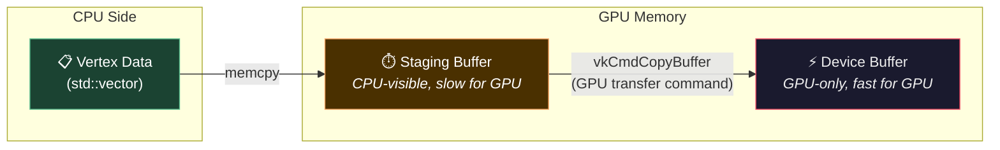

**Why this two-step process?**

| Memory Type | CPU Can Access? | GPU Reads Fast? |
|---|---|---|
| Staging (host-visible) | ✅ Yes | ❌ No (slow) |
| Device-local | ❌ No | ✅ Yes (fast!) |

You copy data to the staging buffer (which the CPU can write to), then issue a GPU command to transfer it to the fast device-local buffer.

#### The Upload Process in Detail

```cpp
void MeshBuffer::uploadBuffers(VulkanContext& ctx, vk::raii::CommandPool& commandPool) {
    // 1. Create staging buffer (CPU-visible) for vertices
    VkBufferCreateInfo vStagingInfo = { VK_STRUCTURE_TYPE_BUFFER_CREATE_INFO };
    vStagingInfo.usage = VK_BUFFER_USAGE_TRANSFER_SRC_BIT;  // "source of a transfer"
    VmaAllocationCreateInfo stagingAllocInfo = {};
    stagingAllocInfo.usage = VMA_MEMORY_USAGE_AUTO;
    stagingAllocInfo.flags = VMA_ALLOCATION_CREATE_HOST_ACCESS_SEQUENTIAL_WRITE_BIT
                           | VMA_ALLOCATION_CREATE_MAPPED_BIT;
    vmaCreateBuffer(...);
    memcpy(mappedData, vertices.data(), bufferSize);  // CPU writes vertex data

    // 2. Create GPU-only buffer for vertices
    VkBufferCreateInfo vBufferInfo = { VK_STRUCTURE_TYPE_BUFFER_CREATE_INFO };
    vBufferInfo.usage = VK_BUFFER_USAGE_TRANSFER_DST_BIT     // "destination of a transfer"
                      | VK_BUFFER_USAGE_VERTEX_BUFFER_BIT;    // "used as vertex buffer"
    vmaCreateBuffer(...);

    // 3. Record and submit a one-time transfer command
    transferCmd.begin({ vk::CommandBufferUsageFlagBits::eOneTimeSubmit });
    transferCmd.copyBuffer(staging, gpuBuffer, copyRegion);
    transferCmd.end();

    // 4. Submit and wait for completion
    ctx.graphicsQueue.submit(submitInfo, *fence);
    ctx.device.waitForFences(*fence, VK_TRUE, UINT64_MAX);
}
```

#### Mesh Batching with `loadMesh()`

```cpp
void MeshBuffer::loadMesh(const std::vector<Vertex>& newVertices,
                           const std::vector<uint32_t>& newIndices) {
    uint32_t indexOffset = static_cast<uint32_t>(vertices.size());
    vertices.insert(vertices.end(), newVertices.begin(), newVertices.end());

    for (uint32_t idx : newIndices) {
        vertIndices.push_back(idx + indexOffset);  // ← Offset indices!
    }
}
```

This is clever: when you load multiple meshes into the same buffer, the indices need to be offset so they point to the right vertices.

---

### 6.6 CommandContext

📄 **Files:** [CommandContext.h](file:///c:/Users/ojasm/source/repos/Vulkan-Graphics-Template/core/CommandContext.h) / [CommandContext.cpp](file:///c:/Users/ojasm/source/repos/Vulkan-Graphics-Template/core/CommandContext.cpp)

**Purpose:** Creates and manages **command pools**, **command buffers**, and **synchronization primitives** (semaphores and fences).

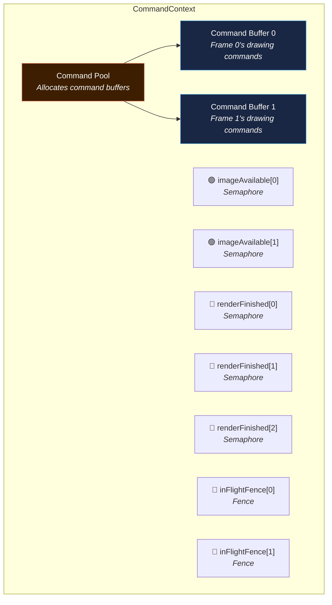

#### Semaphores vs. Fences

| Synchronization Type | Who Waits? | Example Use |
|---|---|---|
| **Semaphore** | GPU waits for GPU | "Don't start rendering until the image is available" |
| **Fence** | CPU waits for GPU | "Don't record new commands until the GPU finished the last frame" |

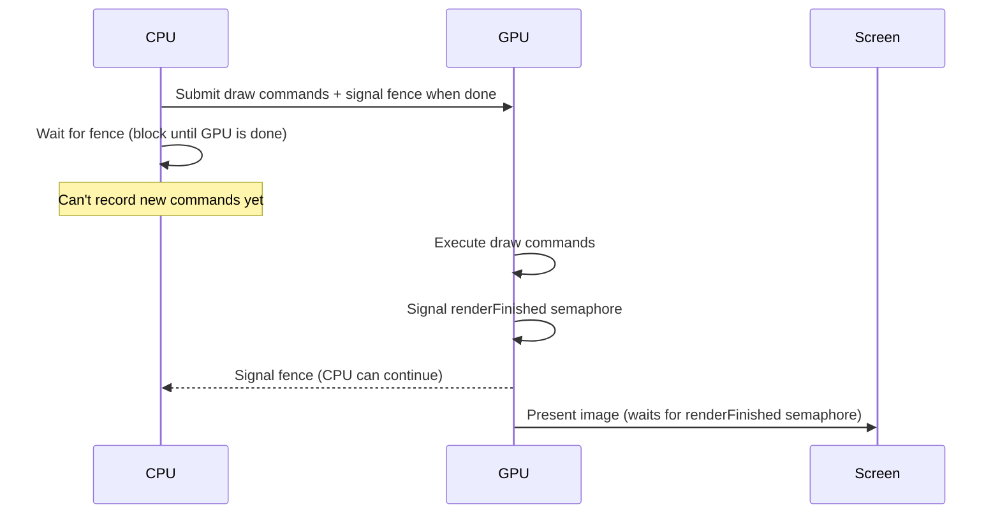

#### Why `MAX_FRAMES_IN_FLIGHT = 2`?

The engine uses **double buffering** for CPU-GPU overlap:

```mermaid
gantt
    title Double Buffering Timeline
    dateFormat X
    axisFormat %s

    section CPU
    Record Frame 0    : 0, 2
    Wait for fence 1  : 2, 3
    Record Frame 1    : 3, 5
    Wait for fence 0  : 5, 6
    Record Frame 0    : 6, 8

    section GPU
    Idle              : 0, 1
    Execute Frame 0   : 1, 4
    Execute Frame 1   : 4, 7
    Execute Frame 0   : 7, 10
```

While the GPU executes frame 0's commands, the CPU can prepare frame 1's commands using a different command buffer. This maximizes hardware utilization.

---

### 6.7 Application

📄 **Files:** [Application.h](file:///c:/Users/ojasm/source/repos/Vulkan-Graphics-Template/core/Application.h) / [Application.cpp](file:///c:/Users/ojasm/source/repos/Vulkan-Graphics-Template/core/Application.cpp)

**Purpose:** The **heart of the engine**. It owns all subsystems, runs the main loop, and dispatches events to layers.

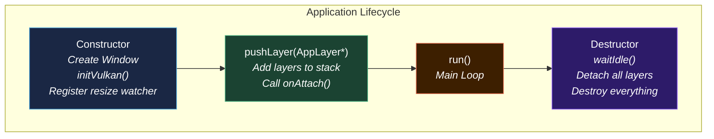

#### The Main Loop

```cpp
void Application::run() {
    while (!m_Window->shouldClose()) {
        m_Window->pollEvents();                              // 1. Check for user input

        if (m_Window->getWidth() == 0 ||
            m_Window->getHeight() == 0) continue;           // 2. Skip if minimized

        auto now = std::chrono::steady_clock::now();
        float deltaTime = std::chrono::duration<float>(
            now - m_LastFrameTime).count();                   // 3. Calculate delta time
        m_LastFrameTime = now;

        for (Layer* layer : m_LayerStack)
            layer->onUpdate(deltaTime);                       // 4. Update all layers

        for (Layer* layer : m_LayerStack)
            layer->onRender();                                // 5. Render all layers

        m_CurrentFrame = (m_CurrentFrame + 1)
                       % MAX_FRAMES_IN_FLIGHT;               // 6. Advance frame index
    }

    m_Ctx->device.waitIdle();                                // 7. Wait for GPU to finish
    for (Layer* layer : m_LayerStack) layer->onDetach();     // 8. Cleanup layers
}
```

#### Resize Event Watcher

The `resizeEventWatcher` is a **static callback** registered with SDL:

```cpp
SDL_AddEventWatch(resizeEventWatcher, this);
```

This is called *during* `SDL_PollEvent()` for resize events, allowing the engine to re-render while the user is dragging the window border. Without this, the screen would go black during resizing.

---

### 6.8 Layer

📄 **File:** [Layer.h](file:///c:/Users/ojasm/source/repos/Vulkan-Graphics-Template/core/Layer.h)

**Purpose:** The abstract base class that all user layers inherit from. It defines the **plugin interface** for the engine.

```cpp
class Layer {
public:
    Layer(const std::string& name = "Layer") : m_DebugName(name) {}
    virtual ~Layer() = default;

    virtual void onAttach()               {}   // Called when layer is added
    virtual void onDetach()               {}   // Called when layer is removed
    virtual void onUpdate(float deltaTime) {}  // Called every frame for logic
    virtual void onRender()               {}   // Called every frame for drawing

    const std::string getName() const { return m_DebugName; }

private:
    std::string m_DebugName;
};
```

> [!NOTE]
> The empty `{}` bodies make all functions **optional** to override. If a layer only needs rendering, it only overrides `onRender()`. The default implementations do nothing, which is safe.

---

## 7. The App Layer — User-Facing Code

📄 **Files:** [AppLayer.h](file:///c:/Users/ojasm/source/repos/Vulkan-Graphics-Template/app/AppLayer.h) / [AppLayer.cpp](file:///c:/Users/ojasm/source/repos/Vulkan-Graphics-Template/app/AppLayer.cpp) / [main.cpp](file:///c:/Users/ojasm/source/repos/Vulkan-Graphics-Template/app/main.cpp)

This is where **your code lives**. The `AppLayer` demonstrates drawing two colored rectangles with camera projection.

### main.cpp — The Entry Point

```cpp
int main() {
    try {
        ApplicationSpecification spec;
        spec.windowSpec.title  = "Vulkan Rectangle - TEMPLATE";
        spec.windowSpec.width  = 1200;
        spec.windowSpec.height = 600;

        Application app(spec);       // Create the engine

        AppLayer appLayer(app);       // Create your layer
        app.pushLayer(&appLayer);     // Register it with the engine

        app.run();                    // Start the main loop!
    }
    catch (const std::exception& error) {
        std::cerr << "\n[ERROR] " << error.what() << "\n";
        return EXIT_FAILURE;
    }
    return EXIT_SUCCESS;
}
```

> [!TIP]
> Notice how `main.cpp` is only ~20 lines. All the complexity is hidden behind `Application` and `AppLayer`. This is the power of good architecture.

### AppLayer::onAttach() — Initializing Resources

When `pushLayer()` is called, `onAttach()` sets up all GPU resources:

1. **Creates the graphics pipeline** (shader compilation happens here)
2. **Creates two rectangles** with vertex/index data
3. **Creates a uniform buffer** for camera data
4. **Allocates a descriptor set** and binds the camera buffer to it

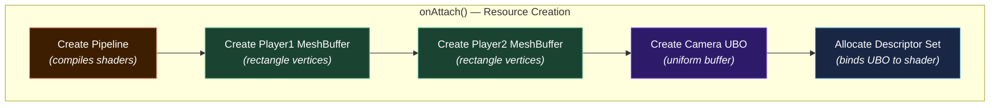

### AppLayer::onUpdate() — Per-Frame Logic

Updates the camera's projection matrix based on the current window aspect ratio:

```cpp
void AppLayer::onUpdate(float deltaTime) {
    float aspectRatio = (float)swapchain.extent.width / (float)swapchain.extent.height;
    m_Projection = glm::ortho(-aspectRatio, aspectRatio, -1.0f, 1.0f, -1.0f, 1.0f);
    m_View = glm::mat4(1.0f);  // Identity — camera at origin

    CameraData camData{};
    camData.projectionView = m_Projection * m_View;
    
    // Upload to GPU
    vmaMapMemory(ctx.allocator.handle, cameraUBO.allocation, &mappedData);
    memcpy(mappedData, &camData, sizeof(CameraData));
    vmaUnmapMemory(ctx.allocator.handle, cameraUBO.allocation);
}
```

### AppLayer::onRender() — The Draw Frame

This is the **most complex function** in the entire project. Here's what it does, step by step:

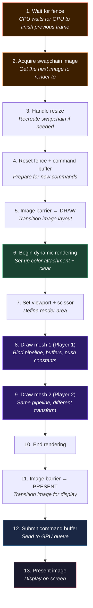

#### Image Layout Transitions

Vulkan images must be in the correct **layout** for each operation. The code uses **pipeline barriers** to transition between layouts:

```
UNDEFINED → COLOR_ATTACHMENT_OPTIMAL → PRESENT_SRC_KHR
   (don't care)    (ready for drawing)     (ready for display)
```

```cpp
// Before rendering: transition to drawing layout
vk::ImageMemoryBarrier drawBarrier(
    {}, vk::AccessFlagBits::eColorAttachmentWrite,
    vk::ImageLayout::eUndefined,                    // From: don't care
    vk::ImageLayout::eColorAttachmentOptimal,        // To: ready for drawing
    ...
);

// After rendering: transition to presentation layout
vk::ImageMemoryBarrier presentBarrier(
    vk::AccessFlagBits::eColorAttachmentWrite, {},
    vk::ImageLayout::eColorAttachmentOptimal,        // From: done drawing
    vk::ImageLayout::ePresentSrcKHR,                 // To: ready for display
    ...
);
```

#### The drawMesh Lambda

```cpp
auto drawMesh = [&](const std::unique_ptr<MeshBuffer>& mesh, const glm::mat4& transform) {
    // 1. Bind vertex and index buffers
    cmd.bindVertexBuffers(0, { mesh->vertexBuffer.buffer }, { 0 });
    cmd.bindIndexBuffer(mesh->indexBuffer.buffer, 0, vk::IndexType::eUint32);

    // 2. Bind the graphics pipeline
    cmd.bindPipeline(vk::PipelineBindPoint::eGraphics, *m_Pipeline->graphicsPipeline);

    // 3. Bind descriptor sets (camera UBO)
    cmd.bindDescriptorSets(vk::PipelineBindPoint::eGraphics, *m_Pipeline->layout,
                           0, { *cameraDescriptorSet }, nullptr);

    // 4. Push the model transform as a push constant
    pushConstantData pc;
    pc.model = transform;
    cmd.pushConstants<pushConstantData>(*m_Pipeline->layout,
                                        vk::ShaderStageFlagBits::eVertex, 0, pc);

    // 5. Issue the draw call
    cmd.drawIndexed(mesh->vertIndices.size(), 1, 0, 0, 0);
};
```

---

## 8. The Shader System

📄 **File:** [Shaders.hlsl](file:///c:/Users/ojasm/source/repos/Vulkan-Graphics-Template/shaders/Shaders.hlsl)

The shaders are written in **HLSL** (High-Level Shading Language) and compiled to **SPIR-V** at runtime using the **Slang** compiler.

### Data Flow Through the Shaders

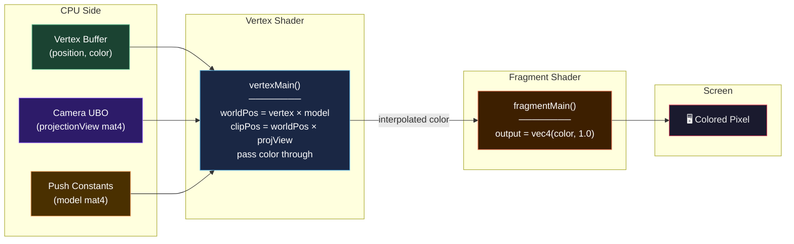

### The Shader Code Explained

```hlsl
// Input struct: what data comes in from the vertex buffer
struct VSInput {
    float2 position : POSITION;   // ← Matches Vertex::position (vec2)
    float3 color    : COLOR;      // ← Matches Vertex::color (vec3)
};

// Output struct: what the vertex shader sends to the fragment shader
struct VSOutput {
    float4 pos   : SV_Position;   // ← Special: clip-space position (required)
    float3 color : COLOR;         // ← Passed through, interpolated per-pixel
};

// Camera data from the uniform buffer (binding 0, space 0)
ConstantBuffer<CameraData> camera : register(b0, space0);

// Model matrix from push constants (updated per-draw-call)
[[vk::push_constant]]
ConstantBuffer<PushConstants> pc;

// ═══════════════════════════════════════════
// VERTEX SHADER — runs once per vertex
// ═══════════════════════════════════════════
[shader("vertex")]
VSOutput vertexMain(VSInput input) {
    VSOutput output;
    float4 localPosition = float4(input.position, 0.0, 1.0);
    float4 worldPosition = mul(localPosition, pc.model);          // Local → World
    output.pos = mul(worldPosition, camera.projectionView);       // World → Clip
    output.color = input.color;                                    // Pass color through
    return output;
}

// ═══════════════════════════════════════════
// FRAGMENT SHADER — runs once per pixel
// ═══════════════════════════════════════════
[shader("fragment")]
float4 fragmentMain(FSInput input) : SV_Target {
    return float4(input.color, 1.0);   // Output the interpolated color with full opacity
}
```

### Descriptors vs. Push Constants

| Mechanism | Size Limit | Update Cost | Use For |
|---|---|---|---|
| **Uniform Buffer (via Descriptor Set)** | Unlimited | Medium (needs map/memcpy) | Camera data, lighting, shared state |
| **Push Constants** | 128–256 bytes (GPU-dependent) | Very low (inline in command buffer) | Per-object transforms (model matrix) |

In this project:
- **Camera projection × view matrix** → Uniform Buffer (changes once per frame)
- **Model transform matrix** → Push Constant (changes per draw call)

---

## 9. The Build System (CMake)

📄 **File:** [CMakeLists.txt](file:///c:/Users/ojasm/source/repos/Vulkan-Graphics-Template/CMakeLists.txt)

### The Two-Target Architecture

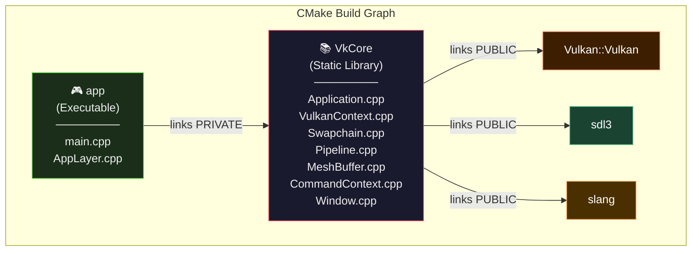

**Key parts of the CMakeLists.txt:**

```cmake
# Core is a STATIC LIBRARY — compiled separately, linked into the app
add_library(VkCore STATIC
    core/Application.cpp
    core/VulkanContext.cpp
    # ... all core files
)

# App is the EXECUTABLE — what actually runs
add_executable(app
    app/main.cpp
    app/AppLayer.cpp
)

# App links against VkCore — this is the architectural boundary
target_link_libraries(app PRIVATE VkCore)
```

### Post-Build Copy Step

```cmake
add_custom_command(TARGET app POST_BUILD
    COMMAND ${CMAKE_COMMAND} -E copy_if_different
        "$ENV{VULKAN_SDK}/Bin/SDL3.dll"
        "$ENV{VULKAN_SDK}/Bin/slang.dll"
        "$ENV{VULKAN_SDK}/Bin/slang-compiler.dll"
        $<TARGET_FILE_DIR:app>
    COMMAND ${CMAKE_COMMAND} -E copy_directory
        "${CMAKE_CURRENT_SOURCE_DIR}/shaders"
        "$<TARGET_FILE_DIR:app>/shaders"
)
```

After building, this automatically copies the required DLLs and shader files next to the executable so it can find them at runtime.

---

## 10. Vulkan Functions & Concepts — Complete Reference

Here's every Vulkan function and concept used in this project, grouped by category.

### Instance & Device Creation

| Function / Type | Where Used | What It Does |
|---|---|---|
| `vk::ApplicationInfo` | VulkanContext | Metadata about the application (name, version, API version) |
| `vk::InstanceCreateInfo` | VulkanContext | Configuration for creating a Vulkan instance |
| `vk::raii::Instance` | VulkanContext | Handle to the Vulkan instance — entry point for all Vulkan work |
| `SDL_Vulkan_GetInstanceExtensions()` | VulkanContext | Gets the Vulkan extensions SDL needs for window integration |
| `SDL_Vulkan_CreateSurface()` | VulkanContext | Creates a Vulkan surface tied to the SDL window |
| `vk::raii::PhysicalDevices` | VulkanContext | Enumerates all GPUs on the system |
| `vk::PhysicalDeviceProperties` | VulkanContext | Properties of a GPU (name, type, limits) |
| `enumerateDeviceExtensionProperties()` | VulkanContext | Lists extensions a GPU supports |
| `getQueueFamilyProperties()` | VulkanContext | Lists queue families (what kinds of work the GPU can do) |
| `getSurfaceSupportKHR()` | VulkanContext | Checks if a queue family can present to a given surface |
| `vk::DeviceCreateInfo` | VulkanContext | Configuration for creating a logical device |
| `vk::raii::Device` | VulkanContext | Handle to the logical device — your interface to the GPU |
| `vk::raii::Queue` | VulkanContext | Handle to a GPU queue for submitting work |

### Swapchain

| Function / Type | Where Used | What It Does |
|---|---|---|
| `getSurfaceCapabilitiesKHR()` | Swapchain | Gets surface capabilities (min/max image count, transforms) |
| `getSurfaceFormatsKHR()` | Swapchain | Gets supported pixel formats |
| `getSurfacePresentModesKHR()` | Swapchain | Gets supported presentation modes (VSync options) |
| `vk::SwapchainCreateInfoKHR` | Swapchain | Configuration for swapchain creation |
| `vk::raii::SwapchainKHR` | Swapchain | Handle to the swapchain |
| `swapchain.getImages()` | Swapchain | Gets the swapchain image handles |
| `vk::ImageViewCreateInfo` | Swapchain | Configuration for how to "view" an image |
| `vk::raii::ImageView` | Swapchain | Handle to an image view |
| `acquireNextImage()` | AppLayer | Gets the index of the next available swapchain image |

### Pipeline

| Function / Type | Where Used | What It Does |
|---|---|---|
| `vk::ShaderModuleCreateInfo` | Pipeline | Wraps compiled SPIR-V bytecode |
| `vk::raii::ShaderModule` | Pipeline | Handle to a shader module |
| `vk::PipelineShaderStageCreateInfo` | Pipeline | Assigns a shader module to a pipeline stage |
| `vk::PipelineVertexInputStateCreateInfo` | Pipeline | Describes vertex buffer layout |
| `vk::PipelineInputAssemblyStateCreateInfo` | Pipeline | How to assemble vertices into primitives |
| `vk::PipelineRasterizationStateCreateInfo` | Pipeline | How to rasterize (fill mode, culling, winding) |
| `vk::PipelineMultisampleStateCreateInfo` | Pipeline | Anti-aliasing settings |
| `vk::PipelineColorBlendStateCreateInfo` | Pipeline | How to blend colors (transparency) |
| `vk::PipelineDynamicStateCreateInfo` | Pipeline | Which states can change at draw time |
| `vk::PipelineLayoutCreateInfo` | Pipeline | Descriptor sets + push constant ranges |
| `vk::PipelineRenderingCreateInfo` | Pipeline | Attachment formats for dynamic rendering |
| `vk::GraphicsPipelineCreateInfo` | Pipeline | The big configuration struct that combines everything |

### Command Recording

| Function / Type | Where Used | What It Does |
|---|---|---|
| `vk::raii::CommandPool` | CommandContext | Allocates command buffers |
| `vk::raii::CommandBuffer` | CommandContext | Records GPU commands |
| `cmd.begin()` | AppLayer | Start recording commands |
| `cmd.end()` | AppLayer | Stop recording commands |
| `cmd.beginRendering()` | AppLayer | Begin a dynamic rendering pass |
| `cmd.endRendering()` | AppLayer | End a dynamic rendering pass |
| `cmd.pipelineBarrier()` | AppLayer | Insert a synchronization/layout transition barrier |
| `cmd.bindPipeline()` | AppLayer | Set which pipeline to use for subsequent draws |
| `cmd.bindVertexBuffers()` | AppLayer | Set which vertex buffer to read from |
| `cmd.bindIndexBuffer()` | AppLayer | Set which index buffer to read from |
| `cmd.bindDescriptorSets()` | AppLayer | Bind shader resources (UBOs, textures) |
| `cmd.pushConstants()` | AppLayer | Send small, fast data to shaders |
| `cmd.setViewport()` | AppLayer | Set the rendering viewport dimensions |
| `cmd.setScissor()` | AppLayer | Set the rendering scissor rectangle |
| `cmd.drawIndexed()` | AppLayer | Issue an indexed draw call |
| `cmd.copyBuffer()` | MeshBuffer | Copy data between GPU buffers |

### Synchronization

| Function / Type | Where Used | What It Does |
|---|---|---|
| `vk::raii::Semaphore` | CommandContext | GPU-GPU synchronization signal |
| `vk::raii::Fence` | CommandContext | CPU-GPU synchronization signal |
| `device.waitForFences()` | AppLayer | CPU blocks until GPU signals the fence |
| `device.resetFences()` | AppLayer | Reset a fence so it can be signaled again |
| `queue.submit()` | AppLayer | Submit command buffers to the GPU queue |
| `queue.presentKHR()` | AppLayer | Present a rendered image to the screen |
| `device.waitIdle()` | Application | Block until ALL GPU work is done |

### Memory (VMA)

| Function | Where Used | What It Does |
|---|---|---|
| `vmaCreateAllocator()` | VulkanContext | Creates the VMA allocator instance |
| `vmaDestroyAllocator()` | VMAWrapper | Destroys the VMA allocator |
| `vmaCreateBuffer()` | MeshBuffer, AppLayer | Allocates a buffer + its GPU memory in one call |
| `vmaDestroyBuffer()` | VMABuffer | Frees a buffer + its GPU memory |
| `vmaMapMemory()` | AppLayer | Maps GPU memory for CPU write access |
| `vmaUnmapMemory()` | AppLayer | Unmaps GPU memory |

### Descriptors

| Function / Type | Where Used | What It Does |
|---|---|---|
| `vk::DescriptorSetLayoutBinding` | Pipeline | Declares what resources a shader binding expects |
| `vk::raii::DescriptorSetLayout` | Pipeline | Handle to a descriptor set layout |
| `vk::raii::DescriptorPool` | VulkanContext | Pool to allocate descriptor sets from |
| `vk::raii::DescriptorSet` | AppLayer | A set of shader resource bindings |
| `vk::WriteDescriptorSet` | AppLayer | Updates a descriptor set to point to a buffer |
| `device.updateDescriptorSets()` | AppLayer | Applies descriptor set writes |

---

## 11. Frame Lifecycle — What Happens Every Frame

This sequence diagram shows the complete journey of a single frame, from start to pixels on screen:

```mermaid
sequenceDiagram
    participant Main as main.cpp
    participant App as Application
    participant Win as Window
    participant Stack as Layer Stack
    participant AL as AppLayer
    participant GPU as GPU
    participant Screen as Screen

    Main->>App: Create(spec)
    Main->>App: pushLayer(appLayer)
    App->>AL: onAttach() — init resources
    Main->>App: run()

    loop Every Frame (while !shouldClose)
        App->>Win: pollEvents()
        Win-->>App: Events (resize, close, keys)
        
        alt Window Close Requested
            App->>App: exit loop
        end

        App->>App: Calculate deltaTime

        loop For each Layer in Stack
            App->>AL: onUpdate(deltaTime)
            Note over AL: Update camera projection<br/>Upload UBO to GPU
        end

        loop For each Layer in Stack
            App->>AL: onRender()
            Note over AL: Wait fence → acquire image<br/>Record commands → submit
            AL->>GPU: Submit command buffer
            GPU-->>Screen: Present image
        end

        App->>App: currentFrame = (currentFrame + 1) % 2
    end

    App->>GPU: waitIdle()
    App->>AL: onDetach() → cleanup resources
```

---

## 12. Memory Management Strategy

The project's memory management is built on three pillars:

```mermaid
graph TD
    subgraph "1. RAII Wrappers"
        A["vk::raii::* types<br/><i>Auto-destroy Vulkan objects</i>"]
        B["VMABuffer / VMAWrapper<br/><i>Auto-destroy VMA allocations</i>"]
        C["SDL_InitRAII<br/><i>Auto-cleanup SDL</i>"]
    end

    subgraph "2. Smart Pointers"
        D["std::unique_ptr<br/><i>Owns heap objects exclusively</i>"]
    end

    subgraph "3. Destruction Order"
        E["Members destroyed in<br/>reverse declaration order<br/><i>Guarantees correct Vulkan<br/>teardown sequence</i>"]
    end

    A --> RESULT["Zero memory leaks<br/>Zero use-after-free<br/>Exception-safe cleanup"]
    B --> RESULT
    C --> RESULT
    D --> RESULT
    E --> RESULT

    style RESULT fill:#1b4332,stroke:#52b788,color:#fff
```

### The Destruction Sequence

When `Application` is destroyed, its members are destroyed in **reverse declaration order**:

```
1. m_LayerStack    (layers detach first)
2. m_CommandContext (sync objects destroyed)
3. m_Swapchain     (swapchain destroyed)
4. m_Ctx           (VulkanContext: device, surface, instance destroyed)
5. m_Window        (SDL window destroyed, SDL_Quit called)
```

This order is critical because Vulkan requires that objects be destroyed before their dependencies (e.g., you must destroy the swapchain before the device, and the device before the instance).

---

## 13. How the Architecture Evolved

The referenced [architecture_diagram.md](file:///c:/Users/ojasm/.gemini/antigravity-ide/brain/226adb12-a454-4605-b93f-a85619fd34a5/architecture_diagram.md) documents the evolution from a monolithic to a polylithic architecture:

### Before: Monolithic Architecture

```mermaid
graph TD
    subgraph "Single Executable (everything mixed)"
        MAIN["main.cpp"]
        APP["Application.h/.cpp<br/><i>User code + engine code<br/>mixed together</i>"]
        VK["VulkanContext"]
        SW["Swapchain"]
        PI["Pipeline"]
        ME["MeshBuffer"]
        CM["CommandContext"]

        MAIN --> APP
        APP --> VK
        APP --> SW
        APP --> PI
        APP --> ME
        APP --> CM
    end

    style APP fill:#6b4c3b,stroke:#8b6c5b,color:#fff
```

> [!WARNING]
> **Problems with the monolith:**
> - No boundary between engine and user code
> - Changing rendering logic means editing engine internals
> - Cannot reuse the engine for a different project
> - Any file can `#include` any other file — no enforced architecture

### After: Core/App Split (Current Architecture)

| Aspect | Before (Monolithic) | After (Core/App Split) |
|---|---|---|
| **CMake Targets** | 1 executable | 1 static library + 1 executable |
| **Application class** | In `app/`, IS the user code | In `core/`, IS the engine |
| **User rendering code** | Hardcoded in `Application::drawFrame()` | In `AppLayer::onRender()` — pluggable |
| **Adding new features** | Edit Application directly | Create a new Layer, push it |
| **main.cpp** | Creates Application, calls run | Creates Application, pushes layers, calls run |
| **Boundary enforcement** | None | Library boundary enforced by CMake |
| **Reusability** | Copy-paste the whole thing | Link against `VkCore`, write new App |

---

> [!TIP]
> **Getting Started with Modifications:**
> 1. Open [AppLayer.cpp](file:///c:/Users/ojasm/source/repos/Vulkan-Graphics-Template/app/AppLayer.cpp)
> 2. Modify `onAttach()` to create different shapes
> 3. Modify `onUpdate()` to add movement logic
> 4. Modify `onRender()` to change how things are drawn
> 5. The Core engine handles everything else!

---

*Documentation generated from the [Vulkan-Graphics-Template](file:///c:/Users/ojasm/source/repos/Vulkan-Graphics-Template) repository.*
